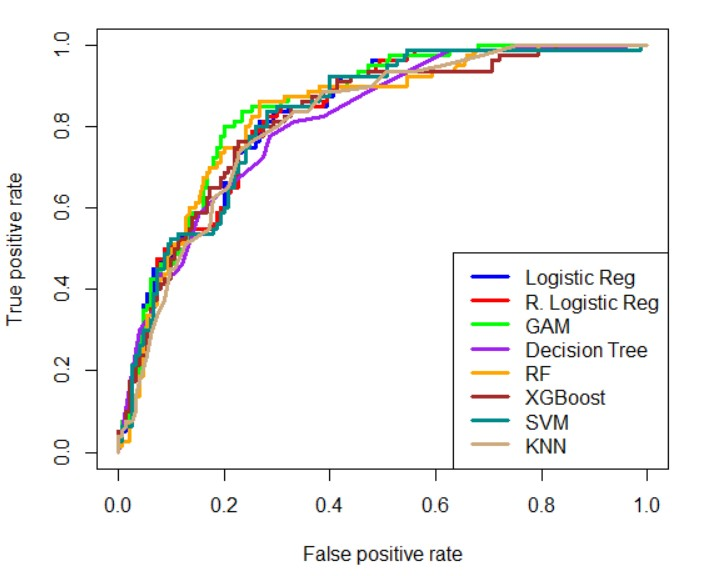
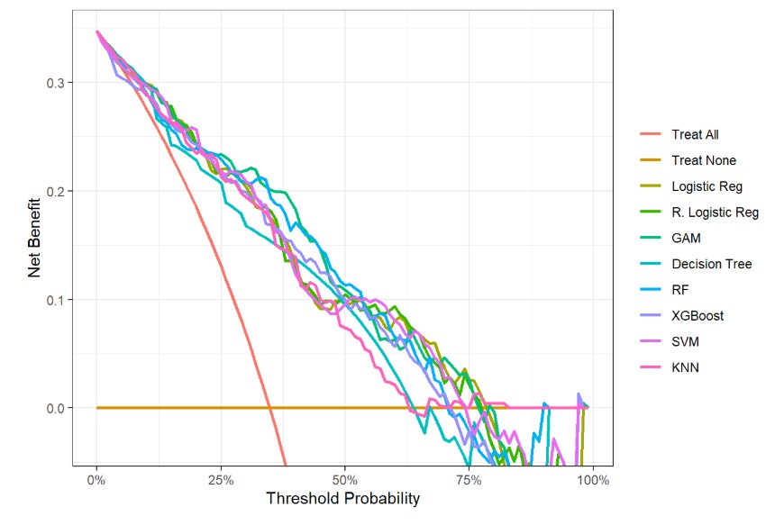
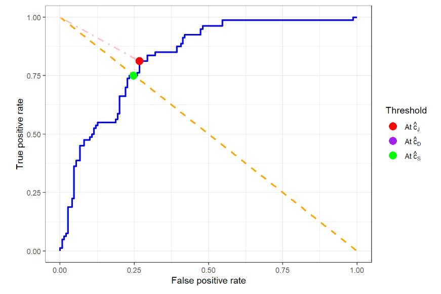
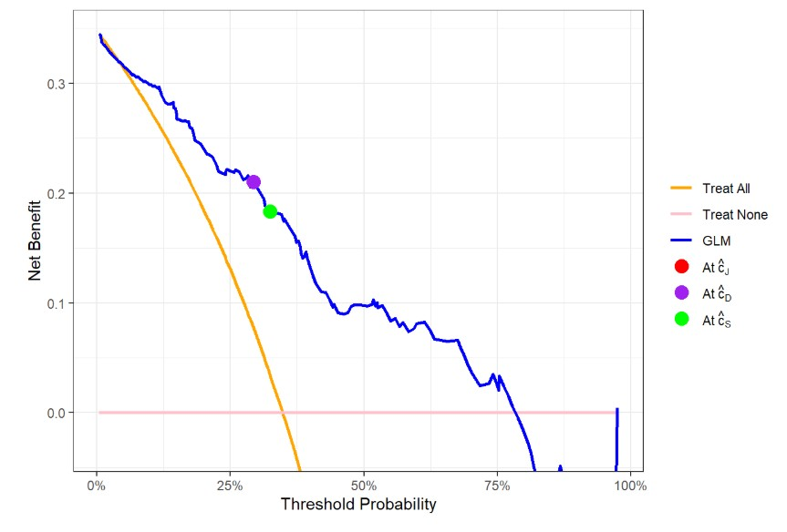

# Pima Indian Diabetes Prediction Using Statistical and Machine Learning Models

## Overview

Diabetes mellitus is a chronic metabolic disease characterized by elevated blood glucose levels and is associated with severe long-term complications if not properly managed. Accurate and timely diagnosis is therefore essential for effective treatment and risk management.

This project investigates the use of statistical and machine learning classification models to predict the presence of diabetes based on diagnostic measurements as part of my master's thesis. The task is formulated as a binary classification problem, distinguishing between individuals with and without diabetes. Multiple models — including logistic regression variants, generalized additive models (GAM), and several machine learning models — are evaluated and compared to assess their predictive performance. The code was developed and executed using RStudio.

## Data

This project uses the Pima Indians Diabetes dataset, which contains 768 observations and 9 variables, including clinical and demographic information on women of Pima Indian heritage aged 21 years and older. The dataset is publicly available at: <https://www.kaggle.com/datasets/uciml/pima-indians-diabetes-database>

The response variable of interest is **Outcome**, a binary indicator representing whether an individual *has diabetes* (`1`) or *doesn't have diabetes* (`0`). All remaining variables were treated as predictors in the classification task.

All variables in the dataset, except for "Outcome", are numerical. The "Outcome" variable is categorical and was therefore converted into a factor. The dataset was split into training and test sets using a 70:30 ratio. Standardization was performed on all numerical variables in the training set. The same scaling parameters were then applied to the test set.

## Methods

Eight statistical and machine learning models were trained:

-   A *Logistic Regression* model;

-   A *Regularized Logistic Regression* model using Least Absolute Shrinkage and Selection Operator (LASSO) regularization, with the optimal value of the regularization parameter $\lambda$ determined via 10-fold cross-validation;

-   A Logistic *Generalized Additive Model (GAM)*, with each smooth function being a cubic spline constructed from at most 15 B-splines;

-   A *Decision Tree* model, using Gini Index as the splitting criterion, with the Complexity Parameter (CP) set to 0.006;

-   A *Random Forest (RF)* model, comprising 500 decision trees;

-   An *Extreme Gradient Boosting (XGBoost)* model, with a learning rate of 0.06 and 100 boosting rounds;

-   A soft-margin *Support Vector Machine (SVM)* model, with the penalty parameter C set to 0.6;

-   A *K-Nearest Neighbors (KNN)* model, with the number of nearest neighbors set to k = 45.

All models were evaluated and compared using Receiver Operating Characteristic (ROC) curve, Decision curve and Area Under the ROC Curve (AUC) with 95% bootstrap confidence intervals. Subsequently, the Logistic Regression model was examined in detail, and three ROC-based criteria together with the net benefit function were used to determine its optimal classification threshold.

#### ROC curve and AUC

> *The Receiver Operating Characteristic curve (**ROC curve**) is a plot of sensitivity against 1 - specificity across different classification thresholds and is used to evaluate the performance of a binary classification model. A ROC curve closer to the top-left corner indicates better classification performance.*
>
> *The Area Under the ROC Curve (**AUC**) is a standard metric for evaluating binary classification performance, with values closer to 1 indicating stronger discriminative ability and 0.5 corresponding to random guessing.*

#### Decision curve

> ***Decision curve** is a plot of the net benefit as a function of the classification threshold and is used to evaluate the clinical utility of a binary classification model. In Decision Curve Analysis (DCA), two default treatment strategies—“Treat none” and “Treat all”—are used as reference baselines for comparison with predictive models.*

#### Classification threshold

> *In medical diagnosis with binary disease classification, the diagnostic outcome distinguishes between diseased and non-diseased individuals. A predictive model estimates the probability that a patient has the disease based on their clinical features. A **classification threshold** is then used to convert this probability into a diagnostic decision: patients with predicted probabilities above the threshold are classified as positive (diseased), while those below the threshold are classified as negative (non-diseased).*

#### Optimal threshold selection

> *To select the best classification threshold for a predictive model, three ROC-based criteria are first used to identify candidate optimal thresholds in terms of classification performance:*
>
> 1.  ***Maximizing Youden Index criterion**, which selects the threshold* $\hat{c}_{J}$ *that maximizes the sum of sensitivity and specificity;*
>
> 2.  ***Closest to (0, 1) criterion**, which selects the threshold* $\hat{c}_{D}$ *that is closest to perfect classification on the ROC space;*
>
> 3.  ***Symmetry Point criterion**, which selects the threshold* $\hat{c}_{S}$ *at which sensitivity equals specificity.*
>
> *These thresholds are then evaluated using DCA, which assesses clinical utility through net benefit. The final **optimal classification threshold** is selected as the one that provides the highest net benefit among the candidates.*

## Results

\-

Although the ROC curves of all eight models aren't close to the top-left corner of the unit square, they lie well above the diagonal line $y=x$, which corresponds to a random guessing model. This indicates that all models exhibit reasonably good classification performance on the test set. According to the decision curves, all eight models achieve higher net benefit than both the “Treat all” and “Treat none” strategies across a wide range of classification thresholds. This suggests that the models provide relatively high clinical utility on the test set.

| Model | Training AUC | Training CI | Test AUC | Test CI |
|:--:|:--:|:--:|:--:|:--:|
| Logistic Regression | 0.8441 | [0.8107, 0.8771] | 0.8283 | [0.7704, 0.8788] |
| Regularized Logistic Regression | 0.8442 | [0.8112, 0.8757] | 0.8283 | [0.7710, 0.8768] |
| GAM | 0.8742 | [0.8403, 0.9015] | 0.8476 | [0.7926, 0.8953] |
| Decision Tree | 0.8932 | [0.8620, 0.9212] | 0.8133 | [0.7535, 0.8678] |
| RF | 1.0000 | [1.0000, 1.0000] | 0.8314 | [0.7746, 0.8809] |
| XGBoost | 0.9999 | [0.9995, 1.0000] | 0.8219 | [0.7665, 0.8753] |
| SVM | 0.8427 | [0.8073, 0.8764] | 0.8271 | [0.7727, 0.8772] |
| KNN | 0.8374 | [0.8030, 0.8720] | 0.8145 | [0.7587, 0.8694] |

: ***Table 1:** Training and test AUCs with 95% bootstrap confidence intervals (CIs) for each model*

For the tree-based models (Decision Tree, Random Forest, XGBoost), the differences between the AUC values ​​on the training and test sets are relatively large, indicating overfitting. In particular, the RF and XGBoost models achieved near-perfect AUC values on the training set but noticeably lower AUC on the test set.

In contrast, for the Logistic Regression, Regularized Logistic Regression, GAM, SVM, and KNN models, the differences between the AUC values ​​on the training and test sets are relatively small, indicating no apparent signs of overfitting. The AUC values ​​of these five models on the test set all fall within the range of 0.81 to 0.85, suggesting good classification performance. Furthermore, the 95% confidence interval of the AUC for each model on the test set are relatively narrow and lie entirely above 0.5. This indicates the stability of the models' performance.

Among these five models, GAM achieved the highest test-set AUC (with AUC = 0.8476) followed closely by Logistic Regression and Regularized Logistic Regression (both with AUC = 0.8283). However, Logistic Regression remains attractive due to its simplicity and interpretability in clinical settings.

\-

For the Logistic Regression model, candidate optimal thresholds were computed using 3 criteria: *Maximizing Youden Index criterion, Closest to (0, 1) criterion, and Symmetry Point criterion*, yielding threshold values of 0.2932, 0.2932, and 0.3249, respectively. Among these, the threshold of 0.2932 provides the highest net benefit for the Logistic Regression model and is therefore selected as the model's final optimal classification threshold.

## References

[1] Sande, S. Z., Seng, L., Li, J., & D’Agostino, R. (2021). Statistical Learning in Medical Research with Decision Threshold and Accuracy Evaluation. *Journal of Data Science, 19(4),* 634-657. <https://doi.org/10.6339/21-JDS1022>
